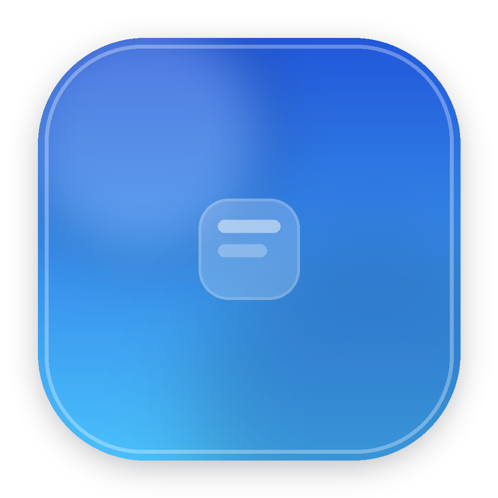
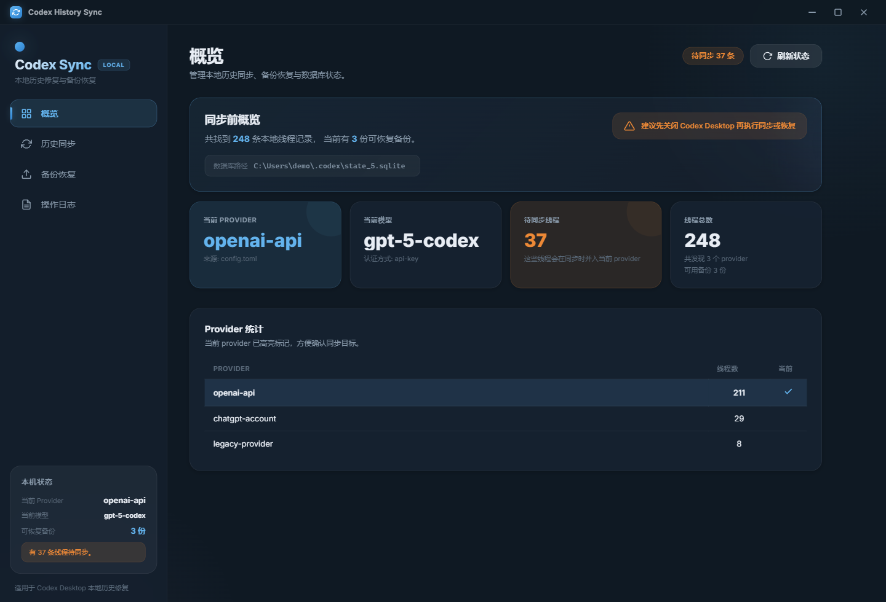
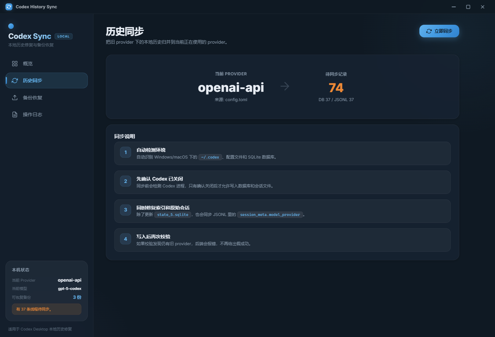
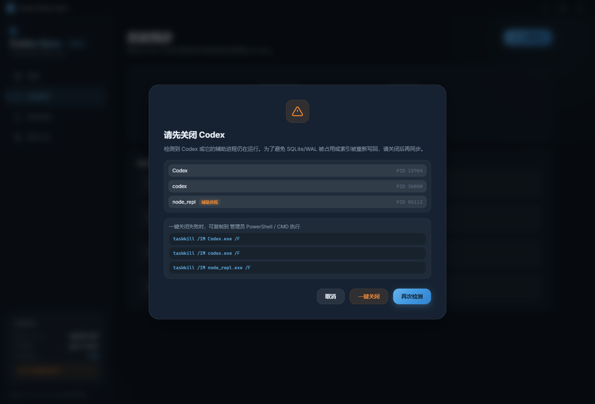
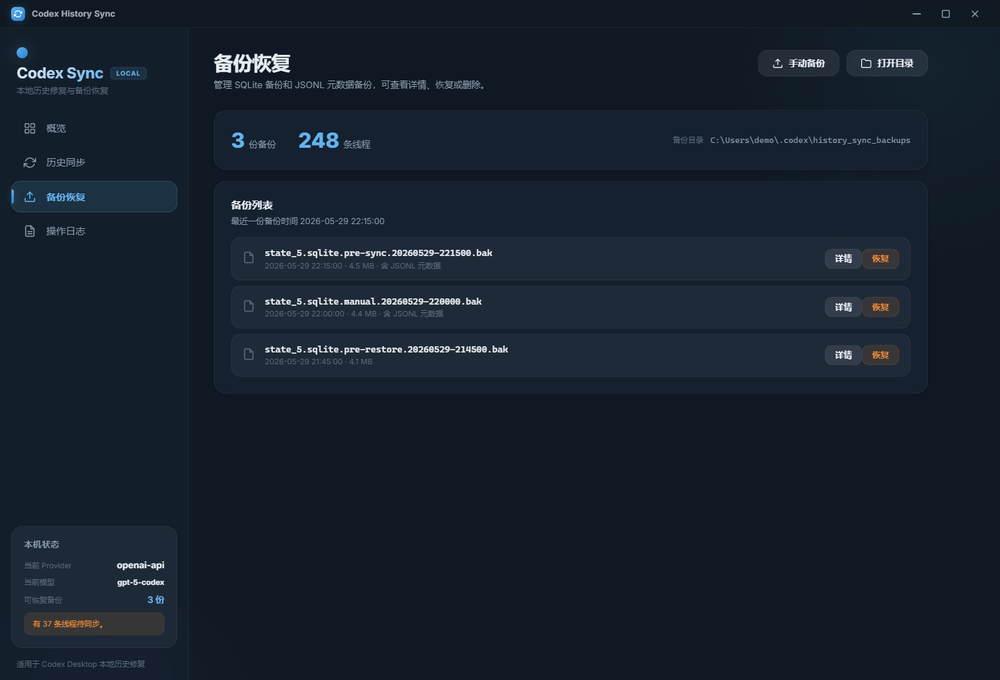
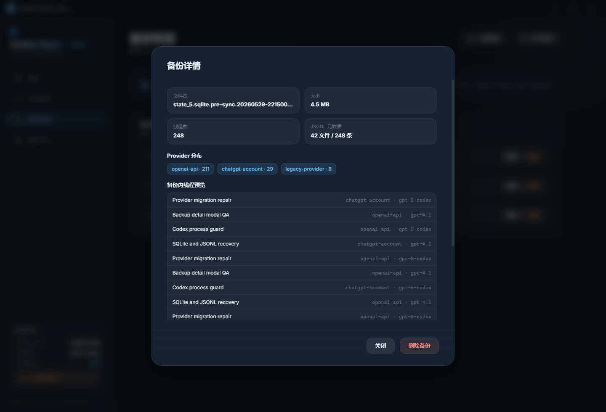

# Codex History Sync

<p align="center">
  
</p>

<p align="center">
  <strong>Restore local Codex Desktop history after provider, API key, or account changes.</strong>
</p>

<p align="center">
  <a href="README.md">中文</a> ·
  <a href="#downloads">Downloads</a> ·
  <a href="#screenshots">Screenshots</a> ·
  <a href="#quick-start">Quick Start</a>
</p>



## Overview

Codex History Sync is a small desktop utility for repairing Codex Desktop's local history index when conversations still exist under `~/.codex`, but disappear from the UI after switching API keys, accounts, auth modes, or `model_provider` values.

It inspects the local Codex configuration and SQLite database, shows the provider distribution, creates backups, and safely rewrites old provider references to the currently active provider. It also updates JSONL `session_meta` entries so the database index and archived sessions stay consistent.

## Features

- Cross-platform backend for Windows and macOS path detection.
- Automatic discovery of `~/.codex`, `config.toml`, `auth.json`, and `state_5.sqlite`.
- Provider distribution overview for local `threads` records.
- Sync SQLite `threads.model_provider` to the current provider.
- Sync JSONL `session_meta.payload.model_provider` for archived sessions.
- Pre-sync and pre-restore backups for SQLite and JSONL metadata.
- Backup detail modal with provider counts and thread previews.
- Backup deletion with a second confirmation.
- Codex process detection before writing, with one-click close and manual fallback commands.
- UTF-8 safe backend output on Windows terminals.

## When To Use

Use this tool when:

- Codex Desktop history disappears after switching account, API key, auth mode, or provider.
- The local `~/.codex` directory still exists.
- `state_5.sqlite` still exists and is readable.
- You want to inspect provider distribution before changing anything.

Do not use it for:

- Merging histories across different machines.
- Syncing conversations between cloud accounts.
- Recovering a deleted or corrupted SQLite database.

## Downloads

| Platform | Architecture | Package | Download |
| --- | --- | --- | --- |
| Windows | x64 | Installer | [Download](https://github.com/gmkrxb/codex-history-sync/releases/latest/download/Codex-History-Sync-Setup-2.0.0-win-x64.exe) |
| Windows | x64 | Portable EXE | [Download](https://github.com/gmkrxb/codex-history-sync/releases/latest/download/Codex-History-Sync-Portable-2.0.0-win-x64.exe) |
| Windows | arm64 | Installer | [Download](https://github.com/gmkrxb/codex-history-sync/releases/latest/download/Codex-History-Sync-Setup-2.0.0-win-arm64.exe) |
| Windows | arm64 | Portable EXE | [Download](https://github.com/gmkrxb/codex-history-sync/releases/latest/download/Codex-History-Sync-Portable-2.0.0-win-arm64.exe) |
| macOS | Intel x64 | DMG | [Download](https://github.com/gmkrxb/codex-history-sync/releases/latest/download/Codex-History-Sync-2.0.0-mac-x64.dmg) |
| macOS | Apple Silicon arm64 | DMG | [Download](https://github.com/gmkrxb/codex-history-sync/releases/latest/download/Codex-History-Sync-2.0.0-mac-arm64.dmg) |
| Linux | x64 | AppImage | [Download](https://github.com/gmkrxb/codex-history-sync/releases/latest/download/Codex-History-Sync-2.0.0-linux-x86_64.AppImage) |
| Linux | x64 | deb | [Download](https://github.com/gmkrxb/codex-history-sync/releases/latest/download/Codex-History-Sync-2.0.0-linux-amd64.deb) |
| Linux | arm64 | AppImage | [Download](https://github.com/gmkrxb/codex-history-sync/releases/latest/download/Codex-History-Sync-2.0.0-linux-arm64.AppImage) |
| Linux | arm64 | deb | [Download](https://github.com/gmkrxb/codex-history-sync/releases/latest/download/Codex-History-Sync-2.0.0-linux-arm64.deb) |

Release assets are built by GitHub Actions for each operating system and architecture.

## Quick Start

Clone the repository, install dependencies, and run the development app:

```powershell
git clone https://github.com/gmkrxb/codex-history-sync.git
cd codex-history-sync
npm install
npm run electron:dev
```

Build only the frontend assets:

```powershell
npm run build
```

Run commands from the repository root.

## Command Reference

### npm Scripts

| Command | Description |
| --- | --- |
| `npm run dev` | Start only the Vite renderer dev server, usually at `http://localhost:5173/`. |
| `npm run build` | Build the Vue renderer into `dist/`. |
| `npm run electron:dev` | Start Vite and Electron together for local development. |
| `npm run electron:build` | Build the renderer and package for the current operating system. |
| `npm run electron:build:win` | Build Windows installer and portable executable. |
| `npm run electron:build:mac` | Build macOS DMG. Run this on macOS. |
| `npm run electron:build:linux` | Build Linux AppImage/deb. Run this on Linux. |

### Backend Executable

Packaged Electron builds do not depend on the user's local Python runtime. The Python backend is bundled as an executable under `backend/`.

Windows:

```powershell
python -m PyInstaller --onefile --clean --noconfirm --name sync_backend --distpath backend --workpath backend\build --specpath backend backend\sync_backend.py
```

macOS / Linux:

```bash
python3 -m PyInstaller --onefile --clean --noconfirm --name sync_backend --distpath backend --workpath backend/build --specpath backend backend/sync_backend.py
```

Generated backend files:

- Windows: `backend/sync_backend.exe`
- macOS / Linux: `backend/sync_backend`

## Backend CLI Options

Backend entry point on Windows:

```powershell
py -3 backend\sync_backend.py [global options] <command> [command options]
```

macOS / Linux:

```bash
python3 backend/sync_backend.py [global options] <command> [command options]
```

### Global Options

| Option | Description |
| --- | --- |
| `--json` | Emit JSON output. Recommended for Electron integration and scripts. |
| `--codex-home <path>` | Override the Codex data directory. Defaults to the current user's `~/.codex`. |

### Commands

| Command | Options | Description |
| --- | --- | --- |
| `status` | None | Show current provider, model, thread counts, provider distribution, and backup list. |
| `detect` | None | Detect platform, Codex home, config path, auth path, and SQLite database path. |
| `processes` | None | Check whether Codex or helper processes are still running. |
| `close-processes` | None | Try to close detected Codex-related processes; returns manual fallback commands when needed. |
| `sync` | None | Sync SQLite and JSONL providers to the current provider. It checks Codex processes and creates backups before writing. |
| `backup` | None | Create a manual SQLite backup. |
| `restore` | `--backup <path>` optional | Restore from a backup. Uses the newest backup when `--backup` is omitted, and creates a safety backup first. |
| `backup-detail` | `--backup <path>` required | Show backup details, including thread count, provider distribution, and thread preview. |
| `delete-backup` | `--backup <path>` required | Delete a SQLite backup and its JSONL session metadata sidecar. |

### Examples

Show status:

```powershell
py -3 backend\sync_backend.py --json status
```

Detect environment:

```powershell
py -3 backend\sync_backend.py --json detect
```

Check Codex processes:

```powershell
py -3 backend\sync_backend.py --json processes
```

Try to close Codex-related processes:

```powershell
py -3 backend\sync_backend.py --json close-processes
```

Run sync:

```powershell
py -3 backend\sync_backend.py --json sync
```

Create a manual backup:

```powershell
py -3 backend\sync_backend.py --json backup
```

Restore the newest backup:

```powershell
py -3 backend\sync_backend.py --json restore
```

Restore a specific backup:

```powershell
py -3 backend\sync_backend.py --json restore --backup "C:\Users\you\.codex\history_sync_backups\state_5.sqlite.pre-sync.20260529-221500.bak"
```

Inspect backup details:

```powershell
py -3 backend\sync_backend.py --json backup-detail --backup "C:\Users\you\.codex\history_sync_backups\state_5.sqlite.pre-sync.20260529-221500.bak"
```

Delete a backup:

```powershell
py -3 backend\sync_backend.py --json delete-backup --backup "C:\Users\you\.codex\history_sync_backups\state_5.sqlite.pre-sync.20260529-221500.bak"
```

Use a custom Codex home:

```powershell
py -3 backend\sync_backend.py --codex-home "D:\CodexData\.codex" --json status
```

## Safety Notes

This tool modifies local Codex data. It creates backups automatically, but you should still close Codex Desktop before sync or restore operations. The app checks for running Codex processes before writing and blocks sync until they are closed.

## Screenshots

### Overview


### Sync



### Process Guard



### Backups



### Backup Detail



## Project Structure

```text
.
├── assets/                 # Application icons
├── backend/                # Python backend for SQLite and JSONL sync
├── electron/               # Electron main/preload process
├── src/                    # Vue 3 renderer application
├── docs/
│   └── screenshots/        # README screenshots
├── package.json            # App scripts and electron-builder config
├── vite.config.js
├── README.md
├── README_EN.md
└── LICENSE
```

## License

MIT
